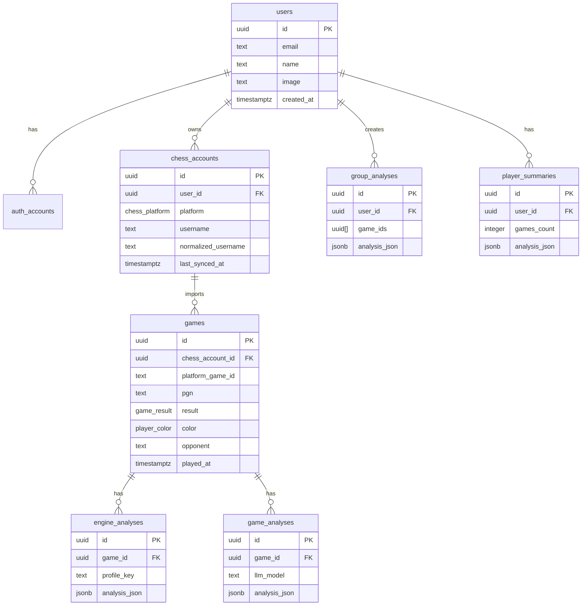

# Chess Analysis App — Схема бази даних

## Призначення

Цей документ описує v1-схему PostgreSQL для Neon + Drizzle ORM. Це не фінальна міграція, а канонічний орієнтир для майбутнього `schema.ts` і SQL-міграцій.

## Загальні рішення

- Основний тип id: `uuid`.
- Часові поля: `timestamptz`.
- Складні результати LLM і Stockfish зберігаються в `jsonb`.
- Дані зовнішніх API нормалізуються перед збереженням.
- Сирі platform-specific metadata можна зберігати в `raw_metadata jsonb`, але UI не має напряму залежати від сирої форми Chess.com або Lichess.
- Значення платформи в БД: `chess_com` і `lichess`; у UI показувати `Chess.com` і `Lichess`.
- NextAuth.js v5 використовує JWT strategy, тому таблиця `auth_sessions` у v1 не створюється.

## Enum-и

```sql
create type chess_platform as enum ('chess_com', 'lichess');
create type game_result as enum ('win', 'loss', 'draw');
create type player_color as enum ('white', 'black');
create type time_control_category as enum ('bullet', 'blitz', 'rapid', 'classical', 'correspondence', 'unknown');
create type analysis_language as enum ('uk');
create type move_classification as enum ('brilliant', 'best', 'good', 'inaccuracy', 'mistake', 'blunder');
```

## Auth-таблиці

Auth-таблиці мають бути сумісні з NextAuth.js v5 / Auth.js adapter-підходом, але з префіксом `auth_`, щоб не плутати їх із продуктовими шаховими акаунтами.

### `users`

Користувач застосунку.

| Поле | Тип | Обов'язкове | Примітки |
|---|---|---|---|
| `id` | `uuid` | так | primary key |
| `email` | `text` | ні | GitHub може не повернути public email |
| `email_verified` | `timestamptz` | ні | для сумісності з Auth.js |
| `name` | `text` | ні | display name з GitHub |
| `image` | `text` | ні | avatar URL |
| `created_at` | `timestamptz` | так | default `now()` |
| `updated_at` | `timestamptz` | так | оновлюється при зміні профілю |

Обмеження / індекси:

- primary key: `id`;
- unique nullable index: `email`, якщо email є.

### `auth_accounts`

OAuth-акаунти, прив'язані до користувача.

| Поле | Тип | Обов'язкове | Примітки |
|---|---|---|---|
| `id` | `uuid` | так | primary key |
| `user_id` | `uuid` | так | FK -> `users.id`, cascade delete |
| `type` | `text` | так | наприклад `oauth` |
| `provider` | `text` | так | для v1: `github` |
| `provider_account_id` | `text` | так | id користувача у provider |
| `refresh_token` | `text` | ні | OAuth token |
| `access_token` | `text` | ні | OAuth token |
| `expires_at` | `integer` | ні | Unix timestamp, якщо provider повертає |
| `token_type` | `text` | ні | OAuth token type |
| `scope` | `text` | ні | OAuth scopes |
| `id_token` | `text` | ні | якщо provider повертає |
| `session_state` | `text` | ні | якщо provider повертає |
| `created_at` | `timestamptz` | так | default `now()` |
| `updated_at` | `timestamptz` | так | оновлюється при зміні |

Обмеження / індекси:

- primary key: `id`;
- foreign key: `user_id` -> `users.id`;
- unique: (`provider`, `provider_account_id`);
- index: `user_id`.

### `auth_verification_tokens`

Не потрібна для GitHub-only v1, але може знадобитись, якщо пізніше з'явиться email auth.

| Поле | Тип | Обов'язкове | Примітки |
|---|---|---|---|
| `identifier` | `text` | так | email або інший identifier |
| `token` | `text` | так | verification token |
| `expires` | `timestamptz` | так | дата завершення |

Обмеження / індекси:

- primary key: (`identifier`, `token`);
- unique: `token`.

## Продуктові таблиці

### `chess_accounts`

Шаховий акаунт користувача на Chess.com або Lichess.

| Поле | Тип | Обов'язкове | Примітки |
|---|---|---|---|
| `id` | `uuid` | так | primary key |
| `user_id` | `uuid` | так | FK -> `users.id`, cascade delete |
| `platform` | `chess_platform` | так | `chess_com` або `lichess` |
| `username` | `text` | так | як ввів користувач або як повернув API |
| `normalized_username` | `text` | так | lowercase/trim для unique check |
| `profile_url` | `text` | ні | посилання на профіль |
| `last_synced_at` | `timestamptz` | ні | останній успішний імпорт |
| `created_at` | `timestamptz` | так | default `now()` |
| `updated_at` | `timestamptz` | так | оновлюється при sync |

Обмеження / індекси:

- primary key: `id`;
- foreign key: `user_id` -> `users.id`;
- unique: (`user_id`, `platform`, `normalized_username`);
- index: (`user_id`, `platform`);

### `games`

Нормалізована партія, імпортована з Chess.com або Lichess.

| Поле | Тип | Обов'язкове | Примітки |
|---|---|---|---|
| `id` | `uuid` | так | primary key |
| `chess_account_id` | `uuid` | так | FK -> `chess_accounts.id`, cascade delete |
| `platform_game_id` | `text` | так | id або URL партії на платформі |
| `source_url` | `text` | ні | URL партії |
| `pgn` | `text` | так | повний PGN |
| `result` | `game_result` | так | результат з перспективи імпортованого гравця |
| `color` | `player_color` | так | колір імпортованого гравця |
| `opponent` | `text` | так | username суперника |
| `opponent_rating` | `integer` | ні | якщо доступно |
| `player_rating` | `integer` | ні | якщо доступно |
| `opening_name` | `text` | ні | якщо доступно з PGN/API |
| `time_control` | `text` | ні | сирий time control з платформи |
| `time_control_category` | `time_control_category` | так | normalized category |
| `rated` | `boolean` | ні | rated/casual |
| `played_at` | `timestamptz` | так | дата початку або завершення партії |
| `move_count` | `integer` | так | кількість повних ходів |
| `raw_metadata` | `jsonb` | ні | platform-specific metadata |
| `imported_at` | `timestamptz` | так | default `now()` |
| `created_at` | `timestamptz` | так | default `now()` |
| `updated_at` | `timestamptz` | так | оновлюється при зміні metadata |

Обмеження / індекси:

- primary key: `id`;
- foreign key: `chess_account_id` -> `chess_accounts.id`;
- unique: (`chess_account_id`, `platform_game_id`);
- index: (`chess_account_id`, `played_at` desc);
- index: (`chess_account_id`, `result`);
- index: (`chess_account_id`, `time_control_category`);
- check: `move_count >= 0`.

### `engine_analyses`

Збережений результат дефолтного Stockfish game review для партії.

| Поле | Тип | Обов'язкове | Примітки |
|---|---|---|---|
| `id` | `uuid` | так | primary key |
| `game_id` | `uuid` | так | FK -> `games.id`, cascade delete |
| `engine_name` | `text` | так | для v1: `stockfish` |
| `engine_version` | `text` | ні | якщо доступно |
| `profile_key` | `text` | так | наприклад `default-v1` |
| `depth` | `integer` | ні | якщо аналіз іде по depth |
| `time_ms_per_position` | `integer` | ні | якщо аналіз іде по часу |
| `analysis_json` | `jsonb` | так | схема нижче |
| `created_at` | `timestamptz` | так | default `now()` |
| `updated_at` | `timestamptz` | так | оновлюється при повторному review |

Обмеження / індекси:

- primary key: `id`;
- foreign key: `game_id` -> `games.id`;
- unique: (`game_id`, `profile_key`);
- index: `game_id`.

### `game_analyses`

LLM-аналіз однієї партії.

| Поле | Тип | Обов'язкове | Примітки |
|---|---|---|---|
| `id` | `uuid` | так | primary key |
| `game_id` | `uuid` | так | FK -> `games.id`, cascade delete |
| `llm_model` | `text` | так | наприклад `gemini-2.0-flash` |
| `language` | `analysis_language` | так | для v1: `uk` |
| `schema_version` | `integer` | так | для v1: `1` |
| `input_hash` | `text` | ні | hash PGN + engine moments + prompt version |
| `prompt_tokens` | `integer` | ні | якщо provider повертає |
| `completion_tokens` | `integer` | ні | якщо provider повертає |
| `analysis_json` | `jsonb` | так | схема нижче |
| `created_at` | `timestamptz` | так | default `now()` |

Обмеження / індекси:

- primary key: `id`;
- foreign key: `game_id` -> `games.id`;
- index: (`game_id`, `created_at` desc);
- index: (`game_id`, `language`);

Рішення для v1: повторний LLM-аналіз створює новий рядок; UI показує найновіший за `created_at`.

### `group_analyses`

LLM-аналіз вибірки з 5-30 партій.

| Поле | Тип | Обов'язкове | Примітки |
|---|---|---|---|
| `id` | `uuid` | так | primary key |
| `user_id` | `uuid` | так | FK -> `users.id`, cascade delete |
| `game_ids` | `uuid[]` | так | вибрані партії; 5-30 id |
| `llm_model` | `text` | так | наприклад `gemini-2.0-flash` |
| `language` | `analysis_language` | так | для v1: `uk` |
| `schema_version` | `integer` | так | для v1: `1` |
| `input_hash` | `text` | ні | hash стислих summaries + prompt version |
| `prompt_tokens` | `integer` | ні | якщо provider повертає |
| `completion_tokens` | `integer` | ні | якщо provider повертає |
| `analysis_json` | `jsonb` | так | схема нижче |
| `created_at` | `timestamptz` | так | default `now()` |

Обмеження / індекси:

- primary key: `id`;
- foreign key: `user_id` -> `users.id`;
- index: (`user_id`, `created_at` desc);
- check: `cardinality(game_ids) between 5 and 30`.

Нотатка: `game_ids uuid[]` простіший для v1, але не дає FK на кожен id. Якщо потрібна суворіша цілісність, можна пізніше замінити на join table `group_analysis_games`.

### `player_summaries`

Накопичувальне LLM-зведення профілю.

| Поле | Тип | Обов'язкове | Примітки |
|---|---|---|---|
| `id` | `uuid` | так | primary key |
| `user_id` | `uuid` | так | FK -> `users.id`, cascade delete |
| `games_count` | `integer` | так | скільки партій враховано |
| `period_days` | `integer` | так | 7 / 30 / 90 |
| `max_games` | `integer` | так | 25 / 50 / 100 |
| `llm_model` | `text` | так | наприклад `gemini-2.0-flash` |
| `language` | `analysis_language` | так | для v1: `uk` |
| `schema_version` | `integer` | так | для v1: `1` |
| `analysis_json` | `jsonb` | так | схема нижче |
| `generated_at` | `timestamptz` | так | default `now()` |

Обмеження / індекси:

- primary key: `id`;
- foreign key: `user_id` -> `users.id`;
- index: (`user_id`, `generated_at` desc);
- check: `games_count >= 5`;
- check: `period_days in (7, 30, 90)`;
- check: `max_games in (25, 50, 100)`.

## JSON-схеми

Це логічні TypeScript-подібні схеми. У коді їх треба валідувати перед збереженням у `jsonb`.

### `engine_analyses.analysis_json`

```ts
type EngineAnalysisJsonV1 = {
  version: 1;
  profileKey: "default-v1";
  engine: {
    name: "stockfish";
    version?: string;
    depth?: number;
    timeMsPerPosition?: number;
  };
  accuracy: {
    white: number;
    black: number;
    player: number;
    opponent: number;
  };
  summary: {
    bestMoveCount: number;
    goodMoveCount: number;
    inaccuracyCount: number;
    mistakeCount: number;
    blunderCount: number;
  };
  moves: Array<{
    ply: number;
    moveNumber: number;
    color: "white" | "black";
    san: string;
    uci?: string;
    fenBefore: string;
    fenAfter: string;
    evalBefore?: {
      type: "cp" | "mate";
      value: number;
    };
    evalAfter?: {
      type: "cp" | "mate";
      value: number;
    };
    bestMove?: {
      san?: string;
      uci: string;
    };
    classification: "brilliant" | "best" | "good" | "inaccuracy" | "mistake" | "blunder";
    centipawnLoss?: number;
    winProbabilityLoss?: number;
    principalVariation?: string[];
  }>;
  keyMoments: Array<{
    ply: number;
    moveNumber: number;
    color: "white" | "black";
    type: "turning_point" | "missed_tactic" | "blunder" | "critical_defense";
    title: string;
    description: string;
  }>;
  evalGraph: Array<{
    ply: number;
    eval?: {
      type: "cp" | "mate";
      value: number;
    };
    bestMove?: {
      san?: string;
      uci: string;
    };
  }>;
};
```

### `game_analyses.analysis_json`

```ts
type GameAnalysisJsonV1 = {
  version: 1;
  language: "uk";
  generalAssessment: string;
  opening: {
    summary: string;
    keyMistakes: string[];
  };
  middlegame: {
    summary: string;
    tacticalMisses: string[];
    positionalIssues: string[];
  };
  endgame: {
    reached: boolean;
    summary?: string;
  };
  criticalMoments: Array<{
    moveNumber: number;
    color?: "white" | "black";
    move?: string;
    description: string;
    recommendation: string;
  }>;
  recommendations: Array<{
    title: string;
    description: string;
    priority: 1 | 2 | 3;
  }>;
};
```

### `group_analyses.analysis_json`

```ts
type GroupAnalysisJsonV1 = {
  version: 1;
  language: "uk";
  patterns: string[];
  tacticalWeaknesses: Array<{
    theme: string;
    evidence: string;
    advice: string;
  }>;
  strategicWeaknesses: Array<{
    theme: string;
    evidence: string;
    advice: string;
  }>;
  openingAssessment: Array<{
    openingName: string;
    issue: string;
    recommendation: string;
  }>;
  actionPlan: Array<{
    priority: 1 | 2 | 3;
    focus: string;
    practiceSuggestion: string;
  }>;
};
```

### `player_summaries.analysis_json`

```ts
type PlayerSummaryJsonV1 = {
  version: 1;
  language: "uk";
  overallSummary: string;
  recurringMistakes: string[];
  improvingAreas: string[];
  stagnantAreas: string[];
  recommendedFocus: Array<{
    priority: 1 | 2 | 3;
    topic: string;
    reason: string;
  }>;
};
```

## ERD у Mermaid



## Відкриті питання по БД

- Чи достатньо `group_analyses.game_ids uuid[]` для v1, чи одразу робимо join table `group_analysis_games`?
- Чи зберігати історію кількох Stockfish re-run для однієї партії, чи завжди оновлювати один `default-v1` запис?
